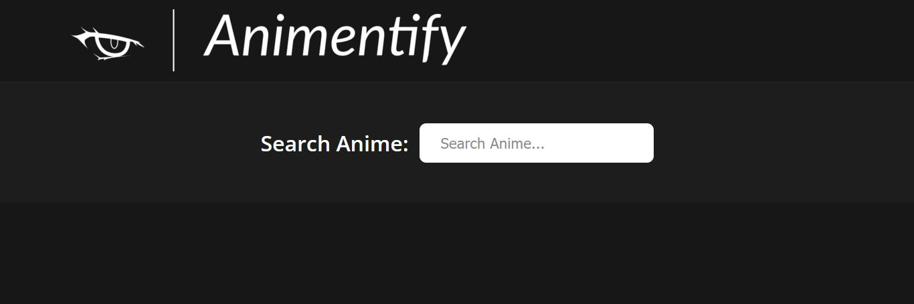
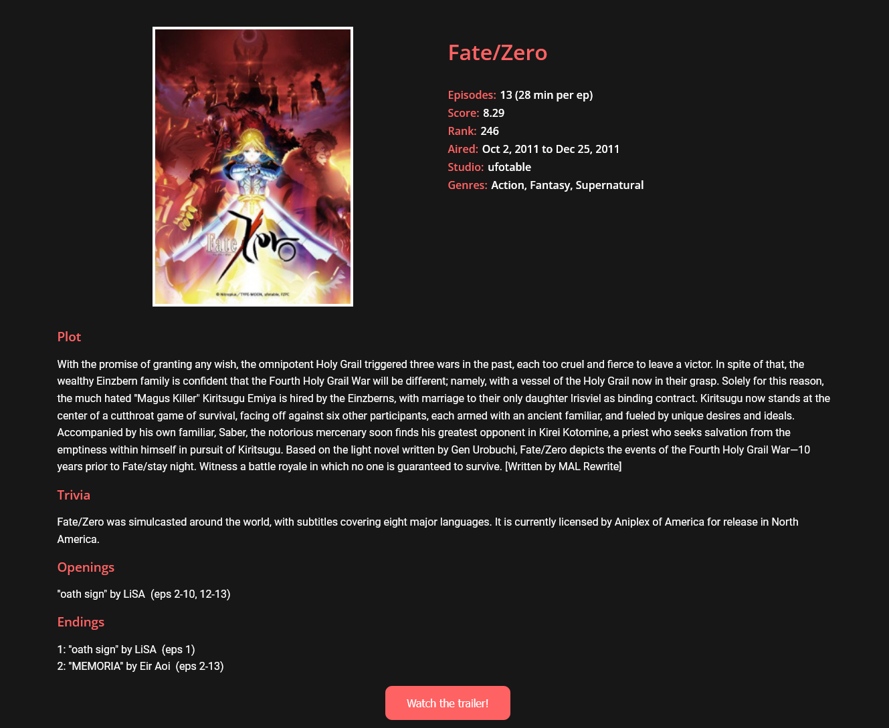

# Animentify

Animentify is an anime search engine that allows users to search for a particular anime and obtain well structured information regarding it. It is built using HTML, CSS and JavaScript. It uses Webpack as a module bundler and Babel to support the application across all browsers.

## API Reference

Animentify uses Jikan V4 API to fetch all information. Jikan is an open-source REST API for the most active online anime community "MyAnimeList". It parses the website to satisfy the need for an API.

#### Get Anime by ID

```http
  https://api.jikan.moe/v4/anime/{id}
```

| Parameter | Type     | Description                       |
| :-------- | :------- | :-------------------------------- |
| `id`      | `integer` | ID of Anime to fetch (Same ID as MyAnimeList)|

## Screenshots






## Installation

1. Clone/Download this repository.

2. Open a terminal inside the project and run the following command. This will install all project dependencies.

```bash
npm install
```

3. Run the following command in the terminal for initializing the development server.

```bash
npm run start
```


